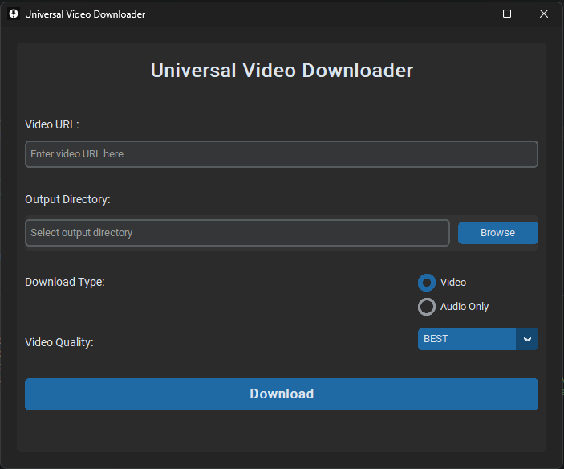

# Simple Video & MP3 Downloader



This is a simple yet powerful video downloader application that can download videos and extract audio from various sources, including YouTube, TikTok, and other video platforms.

## Features

- 🎥 Download videos from multiple sources (YouTube, TikTok, and more)
- 🎵 Extract audio (MP3) from videos
- 🖼️ User-friendly graphical interface
- 📊 Real-time download progress bar
- 📂 Custom output directory selection
- 🎚️ Video quality selection (for video downloads)

## Installation

1. Clone this repository:
   ```
   git clone https://github.com/NimithSan/simple-video-downloader.git
   cd simple-video-downloader
   ```

2. Create a virtual environment (optional but recommended):
   ```
   python -m venv venv
   source venv/bin/activate  # On Windows, use `venv\Scripts\activate`
   ```

3. Install the required dependencies:
   ```
   pip install -r requirements.txt
   ```

## Usage

1. Run the application:
   ```
   python main.py
   ```

2. Enter the URL of the video you want to download.

3. Select the output directory where you want to save the downloaded file.

4. Choose whether you want to download the video or extract audio only.

5. If downloading video, select the desired quality.

6. Click the "Download" button to start the process.

7. Monitor the progress bar and status updates.

8. Once complete, find your downloaded file in the specified output directory.

## Supported Platforms

This downloader supports a wide range of video platforms, including but not limited to:

- YouTube
- TikTok
- Vimeo
- Dailymotion
- Facebook
- Instagram

And many more! If the platform is supported by yt-dlp, it should work with this downloader.

## Contributing

Contributions are welcome! Please feel free to submit a Pull Request.

## License

This project is licensed under the MIT License - see the [LICENSE](LICENSE) file for details.

## Disclaimer

This tool is for personal use only. Please respect the terms of service of the websites you download from and ensure you have the right to download and use the content.