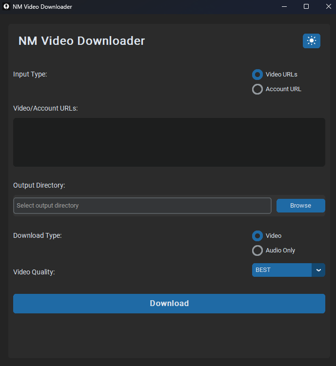

# Simple Video & MP3 Downloader



This is a simple yet powerful video downloader application that can download videos, extract audio, and now also handle batch downloads from various sources, including YouTube, TikTok, and other video platforms.

## Features

- 🎥 **Download videos** from multiple sources (YouTube, TikTok, and more)
- 🎵 **Extract audio (MP3)** from videos
- 🖼️ **User-friendly graphical interface**
- 📊 **Real-time download progress bar**
- 📂 **Custom output directory selection**
- 🎚️ **Video quality selection** (for video downloads)
- 🌀 **Batch download support**: Add multiple URLs or extract all videos from an account
- 🌙 **Light/Dark mode toggle** for UI personalization
- 🔗 **Extract all videos from an account** (This Feature is Working For Tiktok Account only for now)

## Installation

Clone this repository:

```bash
git clone https://github.com/NimithSan/simple-video-downloader.git
cd simple-video-downloader
```

Create a virtual environment (optional but recommended):

```bash
python -m venv venv
source venv/bin/activate  # On Windows, use `venv\Scripts\activate`
```

Install the required dependencies:

```bash
pip install -r requirements.txt
```

## Usage

Run the application:

```bash
python main.py
```

1. Enter the URL(s) of the video(s) you want to download.
2. Select the output directory where you want to save the downloaded file(s).
3. Choose between downloading video or extracting audio only.
4. If downloading video, select the desired quality.
5. Click the "Download" button to start the process.
6. Monitor the progress bar and status updates.
7. Once complete, find your downloaded file(s) in the specified output directory.

## Supported Platforms

This downloader supports a wide range of video platforms, including but not limited to:

- YouTube
- TikTok
- Vimeo
- Dailymotion
- Facebook
- Instagram
- And many more! If the platform is supported by yt-dlp, it should work with this downloader.

## Contributing

Contributions are welcome! Please feel free to submit a Pull Request.

## License

This project is licensed under the MIT License - see the [LICENSE](LICENSE) file for details.

## Disclaimer

This tool is for personal use only. Please respect the terms of service of the websites you download from and ensure you have the right to download and use the content.
